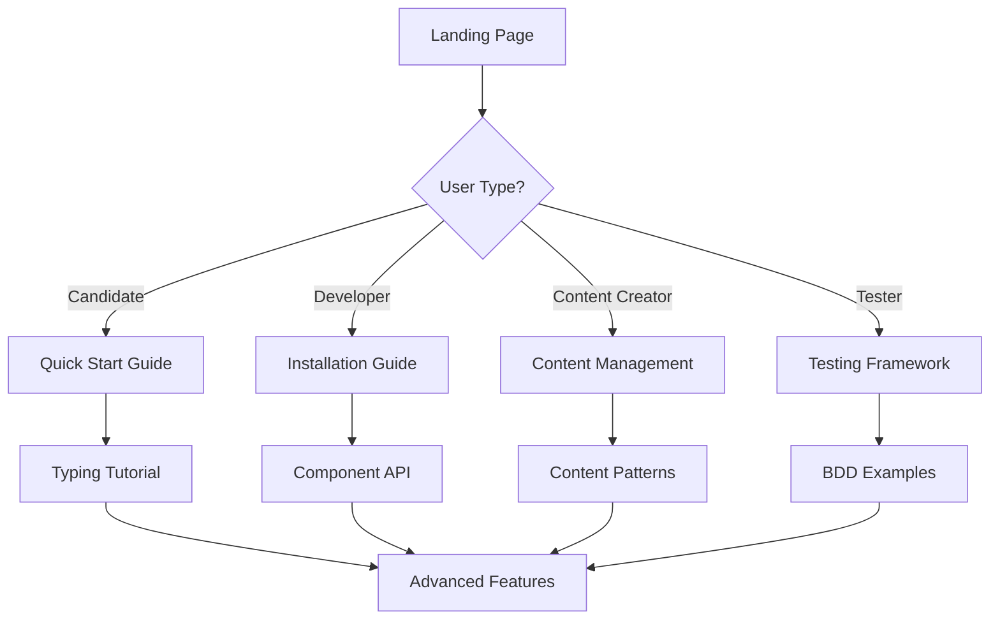

# Library Documentation Architecture Strategy

## Executive Summary

This documentation architecture is designed for the Full-Stack Interview Cookbook Library - a comprehensive typing tutor and practice platform for technical interviews. The library combines:

- **Interactive Typing Tutor**: Monaco Editor-based code typing practice
- **Performance Analytics**: Real-time WPM, accuracy, and error pattern tracking  
- **Interview Content**: Structured cookbook with patterns, drills, and examples
- **Testing Framework**: BDD-driven testing with comprehensive performance monitoring

## 1. Documentation Structure Overview

```
docs/
├── 1-getting-started/          # Quick onboarding path
│   ├── index.md               # Welcome & overview
│   ├── installation.md        # Setup instructions
│   ├── quick-start.md         # 5-minute tutorial
│   └── architecture.md        # High-level system design
├── 2-api-reference/           # Complete API documentation
│   ├── components/            # Vue component APIs
│   ├── composables/           # Composable functions
│   ├── utilities/             # Helper functions
│   └── types/                 # TypeScript definitions
├── 3-guides/                  # In-depth tutorials
│   ├── typing-tutor/          # Building typing interfaces
│   ├── performance-tracking/  # Metrics and analytics
│   ├── content-management/    # Cookbook content system
│   └── testing-integration/   # BDD framework usage
├── 4-examples/                # Live code examples
│   ├── basic-typing-app/      # Simple implementation
│   ├── advanced-metrics/      # Performance tracking
│   ├── custom-exercises/      # Content creation
│   └── testing-patterns/      # Test automation
├── 5-cookbook/                # Interview preparation content
│   ├── strategies/            # High-level approaches
│   ├── backend-patterns/      # Server-side development
│   ├── frontend-patterns/     # Client-side development
│   └── performance-patterns/  # Optimization techniques
└── 6-migration/               # Version upgrade guides
    ├── v1-to-v2.md           # Breaking changes
    ├── configuration.md       # Config migration
    └── best-practices.md      # Modern patterns
```

## 2. Content Strategy

### 2.1 User Journey Mapping

**Primary User Personas:**
1. **Interview Candidates**: Using typing tutor for practice
2. **Library Integrators**: Building applications with our components
3. **Content Creators**: Adding exercises and patterns
4. **Test Developers**: Using our testing framework

**Documentation Journey:**


### 2.2 Content Hierarchy

**Level 1: Essential (Must Read)**
- Quick start tutorial
- Basic component usage
- Core concepts

**Level 2: Important (Should Read)**
- API reference
- Configuration options
- Common patterns

**Level 3: Advanced (May Read)**
- Performance optimization
- Custom integrations
- Troubleshooting

## 3. API Documentation Templates

### 3.1 Component Documentation Template

```markdown
# ComponentName

Brief description of what the component does and its primary use case.

## Props

| Name | Type | Default | Description |
|------|------|---------|-------------|
| prop1 | string | undefined | Description |
| prop2 | number | 60 | Description |

## Events

| Name | Payload | Description |
|------|---------|-------------|
| eventName | PayloadType | When this event is emitted |

## Slots

| Name | Scope | Description |
|------|-------|-------------|
| default | - | Default slot content |

## Examples

### Basic Usage
\`\`\`vue
<ComponentName :prop1="value" @eventName="handler" />
\`\`\`

### Advanced Configuration
\`\`\`vue
<ComponentName 
  :prop1="value"
  :prop2="customValue"
  @eventName="handler"
>
  <template #slotName>
    Custom content
  </template>
</ComponentName>
\`\`\`

## Live Demo

[Interactive example with code playground]

## Accessibility

- ARIA labels and roles
- Keyboard navigation
- Screen reader support

## Related

- [Related Component](#)
- [Related Guide](#)
```

### 3.2 Composable Documentation Template

```markdown
# useComposableName

Brief description of the composable's purpose and functionality.

## Signature

\`\`\`typescript
function useComposableName(
  options?: ComposableOptions
): ComposableReturn
\`\`\`

## Parameters

### ComposableOptions

| Property | Type | Default | Description |
|----------|------|---------|-------------|
| option1 | string | 'default' | Description |
| option2 | boolean | true | Description |

## Return Value

### ComposableReturn

| Property | Type | Description |
|----------|------|-------------|
| value | Ref<string> | Reactive value |
| method | Function | Action method |

## Usage Examples

### Basic Usage
\`\`\`javascript
import { useComposableName } from 'library-name'

export default {
  setup() {
    const { value, method } = useComposableName()
    
    return { value, method }
  }
}
\`\`\`

### With Options
\`\`\`javascript
const { value, method } = useComposableName({
  option1: 'custom',
  option2: false
})
\`\`\`

## Advanced Patterns

[Complex usage scenarios]

## TypeScript Support

[Type definitions and examples]
```

## 4. Interactive Documentation System

### 4.1 Live Code Playground

**Technology Stack:**
- **Monaco Editor**: Code editing with syntax highlighting
- **Nuxt Content**: Markdown processing with Vue components
- **Vue Playground**: Live component rendering
- **Performance Monitoring**: Real-time metrics display

**Playground Features:**
```vue
<template>
  <div class="docs-playground">
    <!-- Code Editor -->
    <MonacoEditor
      v-model="code"
      :language="language"
      :theme="theme"
      @change="updatePreview"
    />
    
    <!-- Live Preview -->
    <ComponentPreview
      :code="code"
      :imports="imports"
      @error="handleError"
    />
    
    <!-- Performance Metrics -->
    <PerformancePanel
      :metrics="renderMetrics"
      :bundle-size="bundleSize"
    />
  </div>
</template>
```

### 4.2 Interactive Tutorials

**Progressive Disclosure Pattern:**
1. **Concept Introduction**: Brief explanation
2. **Basic Example**: Simple, working code
3. **Interactive Practice**: User modifies code
4. **Advanced Scenarios**: Complex implementations
5. **Best Practices**: Optimization tips

**Tutorial Template:**
```markdown
## Step 1: Understanding the Concept

[Brief explanation with diagrams]

## Step 2: Basic Implementation

\`\`\`vue-playground
<template>
  <div>
    <!-- Basic example -->
  </div>
</template>
\`\`\`

## Step 3: Try It Yourself

[Interactive playground with guided modifications]

## Step 4: Advanced Features

[More complex examples with explanations]

## Step 5: Best Practices

[Performance tips and common pitfalls]
```

## 5. Migration Guides Structure

### 5.1 Version Upgrade Framework

**Migration Guide Template:**
```markdown
# Migrating from v1.x to v2.x

## Overview

Brief summary of major changes and benefits of upgrading.

## Breaking Changes

### Component API Changes

| v1.x | v2.x | Migration Path |
|------|------|----------------|
| oldProp | newProp | Replace prop name |
| removedFeature | newApproach | Code example |

### Configuration Changes

\`\`\`diff
// v1.x configuration
- const config = { oldOption: true }
+ const config = { newOption: 'enabled' }
\`\`\`

## Migration Script

Automated migration tool:

\`\`\`bash
npx library-migrate v1-to-v2 ./src
\`\`\`

## Step-by-Step Migration

1. **Update dependencies**
2. **Run migration script**
3. **Update configuration**
4. **Test thoroughly**
5. **Update documentation**

## Common Issues

[FAQ and troubleshooting]
```

## 6. Performance and Analytics

### 6.1 Documentation Performance Metrics

**Key Performance Indicators:**
- Page load times
- Search query success rates
- User engagement metrics
- Code example interaction rates

**Monitoring Strategy:**
```javascript
// Documentation analytics
const documentationAnalytics = {
  // Page performance
  trackPageLoad: (page, loadTime) => {
    analytics.track('docs_page_load', {
      page,
      loadTime,
      userAgent: navigator.userAgent
    })
  },
  
  // Search effectiveness
  trackSearch: (query, results, selectedResult) => {
    analytics.track('docs_search', {
      query,
      resultCount: results.length,
      selectedResult
    })
  },
  
  // Code example interactions
  trackCodeExample: (example, interaction) => {
    analytics.track('docs_code_interaction', {
      example,
      interaction, // 'view', 'copy', 'modify', 'run'
      timestamp: Date.now()
    })
  }
}
```

### 6.2 Content Quality Metrics

**Quality Indicators:**
- Code example accuracy (automated testing)
- Link validation status
- Content freshness scores
- User feedback ratings

**Automated Quality Assurance:**
```javascript
// docs/scripts/quality-check.js
export const qualityChecks = {
  validateCodeExamples: async () => {
    // Test all code examples for syntax and runtime errors
  },
  
  checkLinkHealth: async () => {
    // Validate all internal and external links
  },
  
  analyzeContentFreshness: () => {
    // Check last update dates against code changes
  },
  
  generateQualityReport: () => {
    // Comprehensive quality dashboard
  }
}
```

## 7. Content Management System

### 7.1 Content Creation Workflow

**Authoring Process:**
1. **Content Planning**: Define learning objectives
2. **Draft Creation**: Write in Markdown with front matter
3. **Code Examples**: Create tested, working examples
4. **Review Process**: Technical and editorial review
5. **Publication**: Deploy with analytics tracking

**Content Front Matter Template:**
```yaml
---
title: "Component Name Documentation"
description: "Brief description for SEO and navigation"
category: "api-reference"
subcategory: "components"
difficulty: "intermediate"
lastUpdated: "2025-01-15"
version: "2.1.0"
tags: ["typing", "performance", "analytics"]
relatedDocs: ["related-component", "related-guide"]
codeExamples: true
interactiveDemo: true
---
```

### 7.2 Multi-format Export System

**Export Formats:**
- **HTML**: Web documentation
- **PDF**: Offline reference
- **EPUB**: E-book format
- **JSON**: API for external tools
- **Markdown**: Raw format for integrations

**Export Configuration:**
```javascript
// docs/config/export.js
export const exportConfig = {
  formats: {
    pdf: {
      pageSize: 'A4',
      includeCodeExamples: true,
      tableOfContents: true,
      appendices: ['api-reference', 'migration-guide']
    },
    
    epub: {
      cover: 'assets/cover.png',
      metadata: {
        author: 'Library Team',
        publisher: 'Library Organization'
      }
    },
    
    json: {
      schema: 'openapi-3.0',
      includeExamples: true,
      endpoints: true
    }
  }
}
```

## 8. Search and Navigation

### 8.1 Advanced Search System

**Search Features:**
- **Semantic Search**: Natural language queries
- **Code Search**: Search within code examples
- **Faceted Search**: Filter by category, difficulty, version
- **Autocomplete**: Intelligent suggestions
- **Contextual Results**: Based on current section

**Search Implementation:**
```javascript
// composables/useDocumentationSearch.js
export function useDocumentationSearch() {
  const searchIndex = ref(null)
  const searchResults = ref([])
  
  const semanticSearch = async (query) => {
    // AI-powered semantic search
    const results = await searchAPI.semantic(query)
    return enhanceResults(results)
  }
  
  const codeSearch = async (codeQuery) => {
    // Search within code examples
    const results = await searchAPI.code(codeQuery)
    return results.map(addCodeContext)
  }
  
  const facetedSearch = (filters) => {
    // Multi-dimensional filtering
    return searchIndex.value
      .filter(applyFilters(filters))
      .sort(byRelevance)
  }
  
  return {
    semanticSearch,
    codeSearch,
    facetedSearch,
    searchResults
  }
}
```

### 8.2 Intelligent Navigation

**Navigation Features:**
- **Contextual Sidebar**: Shows relevant sections
- **Breadcrumb Trails**: Clear hierarchy indication
- **Related Content**: Smart recommendations
- **Progress Tracking**: User journey through guides
- **Bookmark System**: Save frequently accessed pages

## 9. Accessibility and Internationalization

### 9.1 Accessibility Standards

**WCAG 2.1 Compliance:**
- **Level AA**: Minimum accessibility standard
- **Keyboard Navigation**: Full functionality without mouse
- **Screen Reader Support**: Proper ARIA labels
- **Color Contrast**: Minimum 4.5:1 ratio
- **Focus Management**: Clear focus indicators

**Accessibility Testing:**
```javascript
// tests/accessibility/docs-a11y.test.js
describe('Documentation Accessibility', () => {
  test('should meet WCAG 2.1 AA standards', async () => {
    const results = await axe.run(page)
    expect(results.violations).toHaveLength(0)
  })
  
  test('should support keyboard navigation', async () => {
    await page.keyboard.press('Tab')
    const focused = await page.evaluate(() => document.activeElement.tagName)
    expect(focused).toBe('A') // First link
  })
})
```

### 9.2 Internationalization Strategy

**Language Support:**
- **English**: Primary language
- **Spanish**: Secondary priority  
- **Chinese (Simplified)**: Large developer community
- **Japanese**: Strong tech adoption

**i18n Implementation:**
```vue
<template>
  <div class="docs-page">
    <h1>{{ $t('page.title') }}</h1>
    <p>{{ $t('page.description') }}</p>
    
    <!-- Code examples with localized comments -->
    <CodeExample
      :code="localizedCode"
      :language="currentLanguage"
    />
  </div>
</template>

<script setup>
import { useI18n } from 'vue-i18n'

const { t, locale } = useI18n()
const localizedCode = computed(() => {
  return codeExamples[locale.value] || codeExamples.en
})
</script>
```

## 10. Deployment and Maintenance

### 10.1 Continuous Deployment Pipeline

**Deployment Strategy:**
```yaml
# .github/workflows/docs-deploy.yml
name: Deploy Documentation
on:
  push:
    branches: [main]
    paths: ['docs/**', 'src/**']

jobs:
  build-and-deploy:
    runs-on: ubuntu-latest
    steps:
      - name: Checkout
        uses: actions/checkout@v3
        
      - name: Build Documentation
        run: |
          npm run docs:build
          npm run docs:test
          npm run docs:quality-check
          
      - name: Deploy to Production
        if: github.ref == 'refs/heads/main'
        run: npm run docs:deploy
        
      - name: Update Search Index
        run: npm run docs:index-update
```

### 10.2 Maintenance Automation

**Automated Tasks:**
- **Link Validation**: Daily checks for broken links
- **Content Freshness**: Weekly reviews of outdated content
- **Performance Monitoring**: Real-time performance tracking
- **User Feedback Processing**: Automated feedback analysis

**Maintenance Dashboard:**
```javascript
// docs/admin/maintenance-dashboard.vue
<template>
  <div class="maintenance-dashboard">
    <!-- Health Metrics -->
    <MetricsPanel
      :link-health="linkHealth"
      :content-freshness="contentFreshness"
      :performance-scores="performanceScores"
    />
    
    <!-- Automated Tasks -->
    <TasksPanel
      :scheduled-tasks="scheduledTasks"
      :completed-tasks="completedTasks"
    />
    
    <!-- User Feedback -->
    <FeedbackPanel
      :recent-feedback="recentFeedback"
      :satisfaction-scores="satisfactionScores"
    />
  </div>
</template>
```

## Implementation Roadmap

### Phase 1: Foundation (Weeks 1-2)
- Set up documentation structure
- Create basic templates
- Implement content management system
- Establish quality standards

### Phase 2: Content Creation (Weeks 3-6)
- Write getting started guides
- Create API reference documentation
- Develop interactive tutorials
- Build code examples library

### Phase 3: Advanced Features (Weeks 7-10)
- Implement search functionality
- Add interactive playgrounds
- Create migration guides
- Develop analytics system

### Phase 4: Polish and Launch (Weeks 11-12)
- Accessibility testing and fixes
- Performance optimization
- User testing and feedback incorporation
- Production deployment

This comprehensive documentation architecture ensures our library provides exceptional developer experience through clear guidance, interactive learning, and comprehensive reference materials.